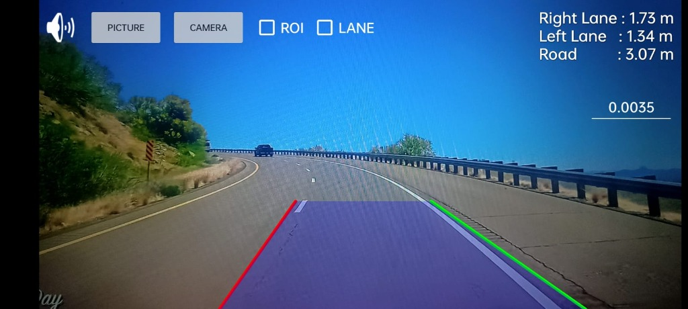
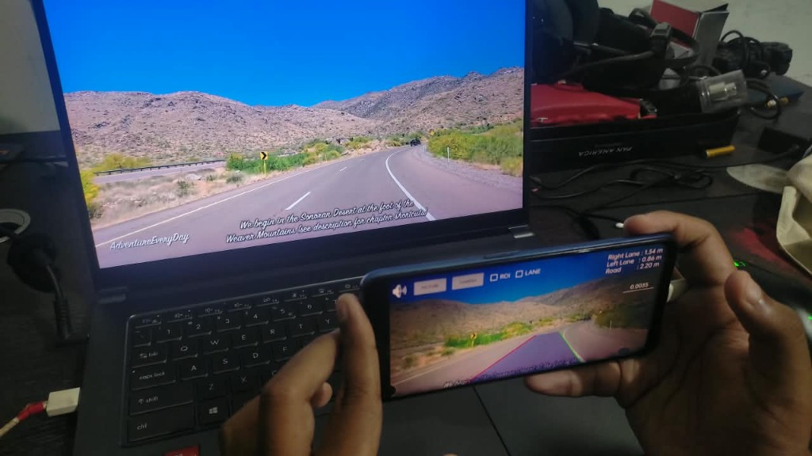

# Lane Vision AI 🛣️🚗
### Real-Time On-Device Lane Detection & Advanced Driver Assistance System (ADAS) for Android

[](https://developer.android.com)
[](https://opencv.org/)
[](https://www.java.com)
[](#-computer-vision-pipeline)
[](LICENSE)

> ### ⚡ Recruiter Quick-Scan (TL;DR)
> - **Domain:** Mobile Computer Vision, Real-Time Edge Processing, Automotive ADAS.
> - **What It Does:** Transforms any Android smartphone into an autonomous **Lane Departure Warning System (LDWS)** that tracks highway lane boundaries, projects a drivable corridor, and computes real-time vehicle-to-lane offsets in meters.
> - **Engineering Highlight:** **100% on-device edge computation** via hardware-accelerated **OpenCV 4.5.3**—zero cloud dependencies, zero network latency, and complete operational privacy.

---

## 📸 Visual Demos & Field Tests

### Example 1: In-App Augmented Reality HUD & Lane Detection
The screenshot below illustrates the active HUD mode running real-time detection on a curved highway:



**What is happening in Example 1:**
- **Boundary Identification:** Detected left lane boundary outlined in **Red** and right lane boundary outlined in **Green**.
- **Drivable Corridor:** An alpha-blended semi-transparent blue/purple polygon dynamically mapped between the fitted lane trajectories to demarcate the vehicle's safe travel zone.
- **Live Telemetry HUD (Top Right):**
  - `Left Lane : 1.34 m` — Real-time distance from the vehicle/camera centerline to the left lane line.
  - `Right Lane : 1.73 m` — Real-time distance from the vehicle/camera centerline to the right lane line.
  - `Road : 3.07 m` — Total detected lane width across both boundaries.
  - `0.0035` — Editable real-time metric calibration scale ($m/\text{pixel}$).
- **Interactive Controls:**
  - `CAMERA`: Engages live camera sensor feed with OpenCV frame listener.
  - `PICTURE`: Allows testing detection accuracy on static benchmark photos.
  - `[ ] ROI`: Developer diagnostic overlay to inspect the trapezoidal Region of Interest.
  - `[ ] LANE`: Toggles the active **Lane Assist** departure alert safety loop.
  - `🔊 / 🔇 Sound Toggle`: Controls audible departure alert chimes.

---

### Example 2: Hardware-in-the-Loop Field Testing & Benchmarking
The image below shows physical hardware-in-the-loop benchmarking under dynamic road conditions:



**Key Observations in Example 2:**
- **Live Optical Stream Ingestion:** An Android test device processes dynamic, high-speed highway footage played on an external workstation monitor.
- **Continuous Edge Processing:** Operates seamlessly via OpenCV's `CameraBridgeViewBase`, maintaining smooth frame rates without UI stutter or memory leaks.
- **Environmental Resilience:** Successfully locks onto dashed and solid boundaries despite strong desert sunlight, background mountain contours, and high-contrast shadows.
- **Real-Time Dynamic Recalibration:** Instantaneous tracking adjustments as vehicle trajectory shifts (`Right Lane: 1.54 m`, `Left Lane: 0.86 m`, `Road: 2.20 m`).

---

## 🛠️ Tech Stack & Core Competencies

| Layer | Technology | Key Implementation |
| :--- | :--- | :--- |
| **Language** | **Java (JDK 8 / 1.8)** | Parallel Streams (`parallelStream`), Lambda expressions |
| **Computer Vision** | **OpenCV Android SDK 4.5.3** | Canny Edge, HoughLinesP, ConvexPoly, Matrix transformations |
| **Video Ingestion** | **OpenCV `CameraBridgeViewBase`** | Asynchronous frame callbacks (`onCameraFrame`) |
| **Mobile Platform** | **Android OS** | Min SDK: `24` (Android 7.0) • Target SDK: `31/32` |
| **Safety System** | **ADAS LDWS** | Directional flashing HUD indicators + audible departure alerts |
| **Architecture** | **Offline Edge CV** | Fully local pipeline, zero cloud reliance |

---

## 🔬 Computer Vision Pipeline

The image processing engine in [`LaneDetector1.java`](app/src/main/java/com/aaron/lanevision/LaneDetector1.java) executes a structured classical CV pipeline on every incoming frame:

```mermaid
flowchart LR
    A["Camera Frame (RGBA)"] --> B["Grayscale & Gaussian Blur (5x5)"]
    B --> C["Canny Edge Detection (150, 200)"]
    C --> D["Morphological Dilation & Erosion"]
    D --> E["Trapezoidal ROI Masking"]
    E --> F["Probabilistic Hough Transform"]
    F --> G["Parallel Slope Filtering & Averaging"]
    G --> H["Line Extrapolation & Polygon Fill"]
    H --> I["Metric Distance & LDWS Telemetry"]
```



1. **Color Space Conversion:** Converts `RGBA` input to single-channel Grayscale (`COLOR_RGBA2GRAY`) to eliminate chromatic variance and reduce computation overhead.
2. **Noise Suppression:** Applies a $5 \times 5$ Gaussian kernel (`GaussianBlur`) to smooth high-frequency sensor noise and road asphalt grain.
3. **Gradient Edge Detection:** Executes Canny edge detection (`Canny`) with tuned hysteresis thresholds ($150, 200$) to highlight high-contrast lane transitions.
4. **Morphological Filtering:** Employs $3 \times 3$ structuring elements with dilation and erosion (`dilate`, `erode`) to bridge broken markings and eliminate isolated noise pixels.
5. **Trapezoidal ROI Masking:** Isolates the drivable road horizon using a trapezoidal polygon mask (`fillConvexPoly` & `bitwise_and`), cutting out irrelevant sky, mountain, and roadside data.
6. **Line Extraction:** Executes the Probabilistic Hough Transform (`HoughLinesP`) to extract discrete line segments from the masked edge map.
7. **Slope Classification & Parallel Stream Averaging:**
   - Calculates slope $m = \frac{y_2 - y_1}{x_2 - x_1}$ for every candidate segment.
   - Categorizes lines into **Right Lane** ($m > 0.5$) and **Left Lane** ($m < -0.5$).
   - Strict slope bounds ($0.5 \le |m| \le 3.0$) filter out horizontal road seams and false artifacts.
   - Computes statistically robust slope and intercept averages using Java 8 parallel streams.
8. **Trajectory Fitting & Drivable Corridor Visualization:**
   - Extrapolates left and right boundary vectors across the road plane.
   - Renders left (red) and right (green) lines with 10px thickness.
   - Blends an alpha-transparent driving corridor polygon (`addWeighted`, $\alpha=0.25$) between boundaries.
9. **Spatial Telemetry Calculation:**
   - Calculates vehicle offset relative to lane center:
     $$\text{Distance} = \left|\frac{\text{Width}}{2} - x_{\text{lane}}\right| \times \text{Factor}$$
   - Converts pixel offsets into real-world meters using the calibrated metric scale ($0.0035\text{ m/px}$).

---

## 🛡️ Lane Departure Warning System (LDWS)

Integrated directly into the camera lifecycle inside [`videoClass.java`](app/src/main/java/com/aaron/lanevision/videoClass.java):
- **Safety Proximity Threshold:** Evaluates vehicle distance against a safety boundary ($\delta = 0.70\text{ m}$).
- **Visual Alert Animation:** Automatically triggers high-visibility pulsing directional arrows (`imageViewAlertL` / `imageViewAlertR`) when an unintentional lane drift occurs.
- **Audible Alerts:** Sounds an immediate audio chime to alert the driver.
- **Runtime In-Flight Calibration:** Drivers can adjust the metric conversion factor on the fly to adapt to different vehicle dashboard heights or phone mounting angles.

---

## 💡 Engineering Highlights (Interview Talking Points)

- **Edge Computing & Zero Cloud Latency:** All matrix transformations execute locally on the mobile CPU/GPU, ensuring safety alerts operate even without cellular reception in remote areas.
- **Memory & GC Conscious:** Matrices and image buffers are reused across frames to minimize heap churn and avoid Android Garbage Collection pauses during live driving.
- **Noise Rejection Under Varied Lighting:** Combines Gaussian smoothing, morphology, and strict angular constraints to maintain line lock during shadows, direct sunlight, and worn road markings.
- **Real-World Metric Translation:** Extends beyond basic edge drawing by delivering real-world spatial measurements in meters, demonstrating practical ADAS software engineering.

---

## 🏛️ Project Structure

```
Lane Vision AI app/
├── assets/                          # Documentation screenshots
│   ├── example1.jpg                 # Example 1: In-app detection HUD screenshot
│   └── example2.jpg                 # Example 2: Hardware field-test photo
├── app/
│   ├── src/main/
│   │   ├── java/com/aaron/lanevision/
│   │   │   ├── LaneDetector1.java   # Core OpenCV pipeline, Hough transform, line fitting
│   │   │   ├── videoClass.java      # Fullscreen CameraActivity, OpenCV bridge, HUD & LDWS
│   │   │   ├── TextFormatter.java   # High-efficiency Spannable HUD formatting
│   │   │   └── InstructionsActivity.java # Onboarding guide with typewriter text animation
│   │   ├── res/                     # Layouts, vector drawables, alert icons
│   │   └── AndroidManifest.xml      # Camera permissions and activity declarations
│   └── build.gradle                 # Dependencies (OpenCV 4.5.3, Material, Play Services)
├── build.gradle                     # Top-level Gradle configuration
└── README.md                        # Project documentation
```

---

## 🚀 Getting Started & Build Instructions

1. **Prerequisites:** Android Studio (Electric Eel or newer) and Android SDK 24+ installed.
2. **Open Project:** In Android Studio, select **File > Open** and choose the `Lane Vision AI app` folder.
3. **Gradle Sync:** Allow Gradle to sync dependencies (`com.quickbirdstudios:opencv:4.5.3.0` will automatically configure).
4. **Deploy:** Connect an Android device with USB debugging enabled, grant camera permissions, and press **Run (Shift + F10)**.

---

## 👨‍💻 Developer & Contact

**Developed by Aaron**  
Passionate about Computer Vision, Mobile Edge AI, and Autonomous Vehicle Systems (ADAS).

- **GitHub:** [Aaron Mohan](https://github.com/aaronmohan)
- **LinkedIn:** [LinkedIn Profile](https://linkedin.com/)
- **Repository:** [Lane Vision AI](https://github.com/aaronmohan/Lane-Vision-AI)
